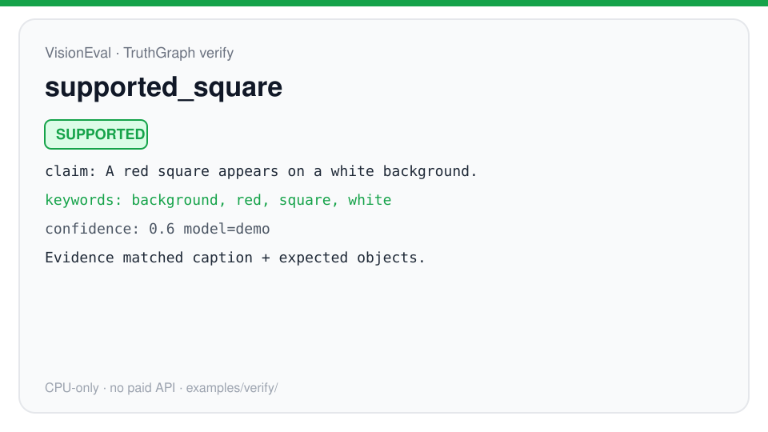
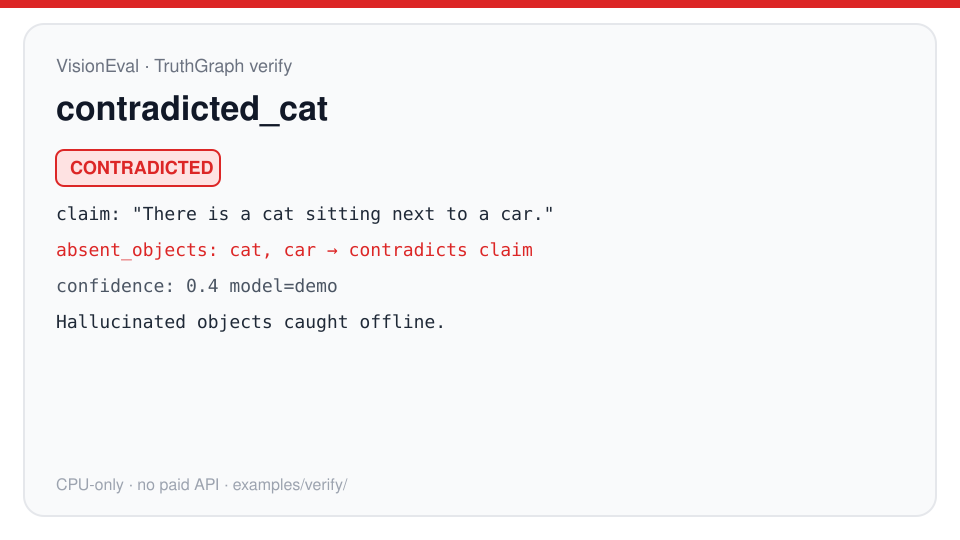
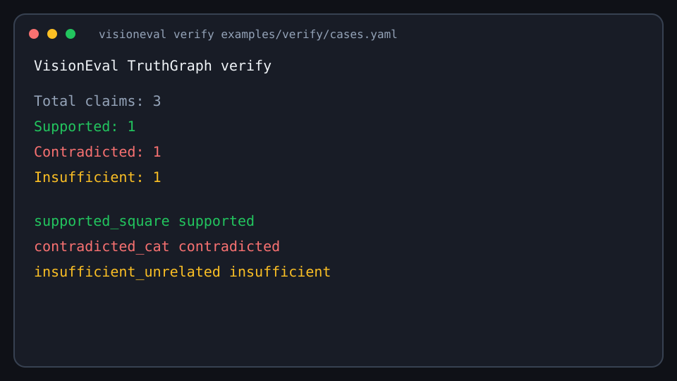

# VisionEval

An open-source tool for testing vision AI models and making sure old mistakes don’t quietly come back.

[](https://github.com/nishanttyagi28/VisionEval/actions/workflows/ci.yml)
[](https://www.python.org/downloads/)
[](LICENSE)
[](https://visioneval.streamlit.app)

People often judge an AI model by one overall score.

That score can go up even while the model keeps failing the same important images. A wrong answer gets fixed once, then slips out of the test set, and a few weeks later it shows up again.

VisionEval is a small toolkit I built to keep those failures around, check them again, and catch them before a new version goes out.

**[Try the live demo](https://visioneval.streamlit.app)** — compare models on simple images in the browser. No login. Runs on a normal computer without a paid API key.

---

## In simple terms

If a recruiter asks “so what does this project actually do?”, here’s how I’d answer.

Imagine a model looks at a photo and says there is a cat when there isn’t one.

VisionEval can remember that mistake and ask the same question again later. If the model fails again, you see it. If a new version brings the mistake back after you thought it was fixed, you see that too.

It can also show *where* the model is struggling — which kinds of images or objects keep going wrong — instead of only telling you that “the score changed.”

And when you don’t want to re-test every image every time, it can focus first on the examples that already caused trouble.

That’s the whole idea: remember, re-check, don’t rely on a single number.

---

## What I built

### Remembers past mistakes

When the model gets something wrong, VisionEval can turn that into a lasting check and run it again on later versions. The check stays until the model gets it right twice in a row.

```bash
visioneval traps harvest reports/mm.json --db artifacts/traps.sqlite3
visioneval traps gate --db artifacts/traps.sqlite3 \
  --lockfile artifacts/baselines/traps.json --json
```

**Why it helps:** A bug you already fixed is less likely to return unnoticed.

### Shows where the model struggles

Instead of only “accuracy went down,” you get a simple map of failures — which samples and which kinds of mistakes keep showing up.

```bash
visioneval maps reports/mm.json --json
```

**Why it helps:** You can investigate a pattern, not just a number.

### Tests risky examples first

You can rank examples by how risky they look (past failures, tagged important cases, uncertain ones, new ones) and test that smaller set first. How much smaller depends on your data that day — the tool reports it per run; I’m not claiming a fixed savings percentage.

```bash
visioneval budget-analyze demo_suite.yaml --json
visioneval run demo_suite.yaml --use-budget
```

**Why it helps:** Less time spent re-checking easy examples that rarely catch problems.

### Works with automated checks

You can save a known-good result, then re-run on every change. If new failures appear or quality drops on the same locked set, the command fails the same way a normal test would.

```bash
visioneval run demo_suite.yaml --update-baseline
visioneval run demo_suite.yaml
```

**Why it helps:** You don’t have to spot a vision problem only by eye in a review.

### Checks model captions against what should be in the image

VisionEval can treat a model’s answer as a claim and check it against simple ground truth (expected objects, captions, present/absent facts), then say supported, contradicted, or not enough evidence.

```bash
visioneval verify examples/verify/cases.yaml --json
```

**Why it helps:** You get an explainable pass/fail on “did the model invent something?” without calling a paid API.

<p align="center">
  
  &nbsp;
  
</p>
<p align="center">
  
</p>

---

## A few numbers

Things you can verify in this repo:

| | |
| --- | --- |
| Automated tests | **109** |
| Main commands | 6 (`run`, `budget-analyze`, `multimodal`, `maps`, `traps`, `verify`) |
| Ways a failure can be recorded | 3 |
| Times a model must pass before an old mistake is retired | 2 |
| Image stress checks (noise, blur, contrast, cover-up) | 4 |
| Demo images in the live app | 2 |
| Samples in the small classification demo | 3 |
| Python | 3.10 or newer |
| License | Apache-2.0 |
| Version | 0.1.0 (still evolving) |
| Live demo | works without a GPU or API key |

---

## Why this matters

The useful part isn’t another score on a screen.

It’s knowing that a mistake you fixed last week didn’t quietly come back this week — and having a boring, repeatable way to check that before you release.

---

## How it works

```text
Model
  ↓
Test examples
  ↓
Find mistakes
  ↓
Remember the important ones
  ↓
Test them again
  ↓
Fail the check if they return
```

Details for engineers are below (install, commands, architecture).

---

## Install

```bash
python -m venv .venv
source .venv/bin/activate          # Windows: .\.venv\Scripts\Activate.ps1
python -m pip install -e ".[dev]"
export PYTHONPATH="$(pwd)"         # Windows: $env:PYTHONPATH = (Get-Location).Path
python -m pytest
```

Optional stacks:

```bash
python -m pip install -e ".[hf,api,ui]"     # real VLMs, OpenAI-compatible APIs, Streamlit
python -m pip install -e ".[metrics]"      # real CLIP/BLIP (pulls torch)
python -m pip install -e ".[all]"
```

API keys stay in the environment (`OPENAI_API_KEY` by default). Don’t commit secrets.

## CLI

```text
visioneval run SUITE [--update-baseline] [--use-budget] [--traps-db PATH]
visioneval budget-analyze SUITE [--json] [--top N] [--traps-db PATH]
visioneval multimodal CONFIG [--json-out PATH] [--markdown-out PATH]
visioneval maps [REPORT] [--json] [--db PATH]
visioneval verify REPORT_OR_SUITE [--json] [--include-corrupted]
visioneval traps list|harvest|run|gate|update-baseline
```

`visioneval truth` is an alias for `verify` (TruthGraph-style claim check; CPU-only).

## Quick start

```bash
# Classification gate
visioneval run demo_suite.yaml --update-baseline
visioneval run demo_suite.yaml
visioneval budget-analyze demo_suite.yaml --json
visioneval run demo_suite.yaml --use-budget

# Multimodal + traps + maps (CPU, no GPU, no API keys)
visioneval multimodal examples/multimodal/config.yaml \
  --json-out reports/mm.json --markdown-out reports/mm.md
visioneval traps harvest reports/mm.json --db artifacts/traps.sqlite3
visioneval traps run --db artifacts/traps.sqlite3 \
  --config examples/multimodal/config.yaml --budget 8
visioneval traps update-baseline --db artifacts/traps.sqlite3 \
  --lockfile artifacts/baselines/traps.json
visioneval traps gate --db artifacts/traps.sqlite3 \
  --lockfile artifacts/baselines/traps.json --json
visioneval maps reports/mm.json --json
visioneval verify reports/mm.json --json
```

More detail: [QUICKSTART.md](QUICKSTART.md), [docs/BUDGET.md](docs/BUDGET.md), [docs/MULTIMODAL.md](docs/MULTIMODAL.md), [docs/MAPS.md](docs/MAPS.md), [docs/TRUTHGRAPH.md](docs/TRUTHGRAPH.md), [DEMO_GUIDE.md](DEMO_GUIDE.md).

### Multimodal dashboard

```bash
python -m pip install -e ".[ui]"
streamlit run app/streamlit_app.py
```

### Tests

```bash
python -m pip install -e ".[dev]"
python -m pytest
```

---

## Example workflow

1. Lock a baseline when the classification results look right.
2. On every change, run the gate.
3. Optionally rank samples and evaluate the riskier subset.
4. For VLMs, harvest failures into traps, promote a lockfile, fail CI if they return.
5. Open a map when you want to see where failures cluster.

```bash
visioneval run demo_suite.yaml --update-baseline
visioneval run demo_suite.yaml
visioneval budget-analyze demo_suite.yaml --json
visioneval run demo_suite.yaml --use-budget

visioneval multimodal examples/multimodal/config.yaml \
  --json-out reports/mm.json --markdown-out reports/mm.md
visioneval traps harvest reports/mm.json --db artifacts/traps.sqlite3
visioneval traps run --db artifacts/traps.sqlite3 \
  --config examples/multimodal/config.yaml --budget 8
visioneval traps update-baseline --db artifacts/traps.sqlite3 \
  --lockfile artifacts/baselines/traps.json
visioneval traps gate --db artifacts/traps.sqlite3 \
  --lockfile artifacts/baselines/traps.json --json
visioneval maps reports/mm.json --json
```

---

## Demo

**Live:** [https://visioneval.streamlit.app](https://visioneval.streamlit.app)

You can compare two fake models on simple shapes, look at scores, and export Markdown/JSON. It runs on CPU and does not ask for an API key.

<p align="center">
  
  &nbsp;
  
</p>

<p align="center">
  
</p>

---

## Why I built this

I kept seeing model evaluation reduced to a score, while the individual mistakes were easy to forget. I wanted a small tool that could remember those failures and make them part of the normal development loop — closer to unit tests than to a one-off notebook.

---

## Status

**WIP · v0.1.0 · actively developed.**

Useful today for demos, experiments, and local CI-style checks. Schemas and APIs may still move. Pin a commit if you depend on specific behavior. I’m not calling this a finished product.

## License

Apache-2.0. See [LICENSE](LICENSE).
