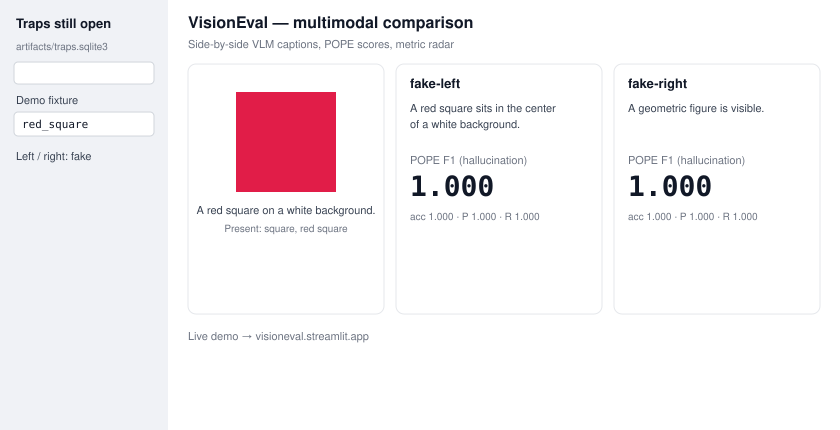

# VisionEval

**The eval harness that remembers when your VLM hallucinates.**

[](https://github.com/nishanttyagi28/VisionEval/actions/workflows/ci.yml)
[](https://www.python.org/downloads/)
[](LICENSE)
[](https://visioneval.streamlit.app)
[](https://visioneval.streamlit.app)


<p align="center">
  <sup><a href="https://visioneval.streamlit.app">Live demo → visioneval.streamlit.app</a> · no login, CPU-only fake models</sup>
</p>

<p align="center">
  
  &nbsp;
  
</p>

<p align="center">
  <sub>
    Left: <code>red_square</code> — fake-left names the square, fake-right stays generic, both POPE F1 1.000.
    Right: <code>blue_circle</code> — same pair, metric radar and export.
  </sub>
</p>

Static multimodal benchmarks go stale the week they ship. Models memorize the set. Intermittent hallucinations never make the next leaderboard cut.

VisionEval is a **CI-native** evaluation stack for vision and VLMs:

1. A **classification release gate** that fails the job on a new failure or an accuracy drop against a git-trackable baseline.
2. An **adaptive evaluation budget** — `visioneval budget-analyze` ranks samples without running the model; `visioneval run --use-budget` evaluates that recommended subset.
3. A **four-pillar multimodal framework** (alignment, hallucination probes, robustness, models + dashboard).
4. **Living traps** with a **visual red-team CI gate** (`visioneval traps gate`): every VLM hallucination becomes a durable SQLite test; lockfile regressions (`new_open` / `reappeared` / `worse`) exit `1`.
5. **Black-box hallucination maps** (`visioneval maps`): CPU-only locus of consistent failures by object, probe type, sample, and metric.

The layers sit beside each other. `visioneval run` is still the classification blocker (optionally budget-aware). Living traps and maps never write classification tables.

---

## Quick start

Python 3.10+. From the repository root:

```bash
python -m venv .venv
source .venv/bin/activate          # Windows: .\.venv\Scripts\Activate.ps1
python -m pip install -e ".[dev]"
export PYTHONPATH="$(pwd)"         # Windows: $env:PYTHONPATH = (Get-Location).Path
python -m pytest
```

**Classification CI**

```bash
visioneval run demo_suite.yaml --update-baseline
visioneval run demo_suite.yaml          # exit 0 on PASS, 1 on REGRESSION
visioneval budget-analyze demo_suite.yaml
visioneval budget-analyze demo_suite.yaml --json
```

**Budget-aware classification run**

```bash
visioneval run demo_suite.yaml --use-budget
visioneval run demo_suite.yaml --use-budget --traps-db artifacts/traps.sqlite3
```

**Multimodal eval + living traps + maps** (CPU, no GPU, no API keys)

```bash
visioneval multimodal examples/multimodal/config.yaml \
  --json-out reports/mm.json --markdown-out reports/mm.md

visioneval traps list --db artifacts/traps.sqlite3
visioneval traps harvest reports/mm.json --db artifacts/traps.sqlite3
visioneval traps run --db artifacts/traps.sqlite3 \
  --config examples/multimodal/config.yaml --budget 8
visioneval traps update-baseline --db artifacts/traps.sqlite3 \
  --lockfile artifacts/baselines/traps.json
# CI gate (exit 1 on new_open / reappeared / worse):
visioneval traps gate --db artifacts/traps.sqlite3 \
  --lockfile artifacts/baselines/traps.json --json

visioneval maps reports/mm.json
visioneval maps reports/mm.json --json --db artifacts/traps.sqlite3
```

**Dashboard**

```bash
python -m pip install -e ".[ui]"
streamlit run app/streamlit_app.py
```

Full file contents: [QUICKSTART.md](QUICKSTART.md). Fail-fast walkthrough: [DEMO_GUIDE.md](DEMO_GUIDE.md).

---

SEE_REPO_FOR_REST
