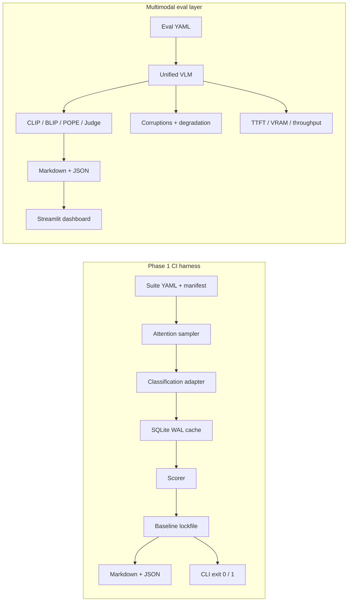

# VisionEval

Two layers, one package:

1. **Phase 1 classification CI harness** — deterministic, risk-focused image-classification evaluation that fails a job on a new failure or an accuracy drop against a git-trackable baseline.
2. **Multimodal evaluation framework** — CLIP/BLIP alignment, POPE hallucination probes, structured LLM-as-a-judge, corruption stress tests, unified VLM adapters, inference profiling, and a Streamlit comparison dashboard.

The multimodal layer **sits beside** the CI harness. It does not replace `visioneval run`, the attention sampler, SQLite failure memory, or baseline lockfiles. Living traps are a third, opt-in memory for VLM hallucinations (`vlm_traps`); they never write classification tables.

## The problem (CI harness)

Aggregate accuracy can hide a drop on safety-critical or previously failing images. Scoring every sample on every commit is often too slow for CI. VisionEval evaluates a **deterministic, risk-focused subset** and treats a new failure or an accuracy drop on the **same locked population** as a release blocker.

## Architecture



```text
visioneval/
  cli.py                 visioneval run | visioneval multimodal | visioneval traps
  core/                  Phase 1 suite, sampler, runner, cache, baseline, reports
  classification/        adapter loading, scoring, optional Torchvision / ONNX
  metrics/               CLIPScore, BLIP-Score, POPE, LLM-as-a-judge (swappable)
  robustness/            gaussian noise, motion blur, contrast, occlusion + drop-off
  models/                Fake / HuggingFace / OpenAI-compatible VLM wrappers
  profiling/             TTFT, total time, GPU VRAM, throughput
  report/                multimodal Markdown + JSON serializers
  multimodal/            YAML config + end-to-end pipeline
  traps/                 living VLM hallucination traps (SQLite WAL, opt-in)
app/streamlit_app.py     side-by-side comparison dashboard
examples/                classification suite + multimodal demo
tests/                   pytest (CI harness + multimodal math)
```

---

## Phase 1 — attention-guided classification CI

Selection is seed-stable and ordered by priority. A sample is chosen once, at its highest matching bucket:

1. Previous failures (SQLite history)
2. Configured high-risk tags
3. Catalog confidence at or below the threshold
4. Seeded random coverage

Default budget split: **40% / 30% / 15% / 15%**. Unused quota from an earlier attention bucket is given to the next attention bucket before random coverage. Every record stores `selection_reason`, `attention_score`, and `risk_bucket`.

### Failure memory

The local SQLite store keeps more than the last pass/fail bit: **`fail_count`** and **`consecutive_passes`**. A sample stays in the previous-failure bucket until it **passes twice in a row**, so one recovered run does not drop intermittent failures. The same database caches predictions; keys include model identity, preprocess identity, and image bytes when `image_path` is set.

### Regression detection

`--update-baseline` writes a sorted JSON lockfile: accuracy, per-sample outcomes, suite hash, model id, attention seed, budget, and selected sample ids. Later runs:

- Compare accuracy and new/fixed failures only on **ids present in both** the baseline and the current selection.
- Treat a **disjoint** selection (no shared ids) as a regression.
- Fail if suite hash, model id, seed, or budget **do not match** the lockfile.
- Exit **1** when `is_regression` is true.

With `execution.fail_fast: true`, evaluation is sequential and stops on the first **new** failure, then writes a partial report. Do not pass `--update-baseline` in CI.

### Quick start (classification CI)

Python 3.10+. From the repository root:

```bash
python -m venv .venv
# Windows PowerShell: .\.venv\Scripts\Activate.ps1
source .venv/bin/activate
python -m pip install -e ".[dev]"
export PYTHONPATH="$(pwd)"   # Windows: $env:PYTHONPATH = (Get-Location).Path
```

```bash
visioneval run demo_suite.yaml --update-baseline
visioneval run demo_suite.yaml
```

The second command exits `0` on **PASS**. Full file contents: [QUICKSTART.md](QUICKSTART.md). Walkthrough with fail-fast: [DEMO_GUIDE.md](DEMO_GUIDE.md).

The installed `visioneval` script does not put the current directory on `PYTHONPATH`; set it as above so a local adapter imports. Optional Torchvision and ONNX adapters in `visioneval.classification.backends` load lazily.

---

## Multimodal evaluation framework

Four pillars, all swappable, all testable without downloading weights or hitting paid APIs.

### Pillar 1 — metrics

| Metric | What it scores | Default backend |
| --- | --- | --- |
| **CLIPScore** | Semantic image–text alignment (`w * max(cos, 0)`, `w = 2.5`) | hashed mock |
| **BLIP-Score** | Image–text matching probability in `[0, 1]` | hashed mock |
| **POPE** | Visual hallucinations: accuracy, precision, recall, F1 | yes/no probes |
| **LLM-as-a-judge** | `detail_richness`, `factual_consistency`, `spatial_accuracy` as JSON | heuristic mock |

Real CLIP/BLIP weights (`transformers`) and a paid JSON judge (`openai`) are optional extras. Tests always use mocks.

### Pillar 2 — robustness

Corruptions: Gaussian noise, motion blur, contrast jitter, random occlusion. Each is seeded and identity at severity `0`. The pipeline re-runs metrics across severities and reports **drop-off** `(clean - corrupted) / |clean|` and **resilience** `1 - mean(drop-off)`.

### Pillar 3 — models and profiling

`VisionLanguageModel` / `BaseVLM` with three adapters:

- `fake` — lookup-table captioner + POPE yes/no from an object map (always importable)
- `hf` — HuggingFace `Qwen2-VL` / `LLaVA` / Auto (extra `hf`)
- `api` — OpenAI-compatible vision chat (extra `api`)

Every generation records **TTFT**, **total inference time**, **GPU VRAM** (when CUDA is present), and **throughput** (tokens/s).

### Pillar 4 — dashboard and reports

```bash
pip install -e ".[ui]"
streamlit run app/streamlit_app.py
```

Side-by-side responses, POPE hallucination scores, radar charts, and downloadable Markdown/JSON. CLI reports use the same serializers:

```bash
visioneval multimodal examples/multimodal/config.yaml \
  --json-out reports/mm.json --markdown-out reports/mm.md
```

### Install extras

```bash
pip install -e ".[dev]"           # tests + core (numpy, pillow, pydantic, ...)
pip install -e ".[hf,api,ui]"     # real VLMs, OpenAI-compatible APIs, Streamlit
pip install -e ".[metrics]"       # real CLIP/BLIP via transformers (pulls torch)
pip install -e ".[all]"           # everything
```

A laptop without a GPU can `import visioneval` and run the fake/mock stack. HuggingFace and API adapters raise a clear `ImportError` that names the extra until you install it.

### YAML config (multimodal)

See [`examples/multimodal/config.yaml`](examples/multimodal/config.yaml). Models, metric toggles, corruption types/severities, and the judge prompt live in one file. Samples can be inline or a separate `samples_path`. Tiny RGB scenes are synthesised from a `color` key (`red_square`, `blue_circle`, `green_split`) so the demo never ships binary weights or datasets.

HF / API sketches:

```yaml
models:
  - name: qwen2-vl
    kind: hf
    model_id: Qwen/Qwen2-VL-2B-Instruct
    hf_kind: qwen2_vl
  - name: gpt-4o-mini
    kind: api
    model: gpt-4o-mini
    api_key_env: OPENAI_API_KEY   # read from the environment only
```

### How the two layers compose

| Concern | CI harness (`visioneval run`) | Multimodal layer (`visioneval multimodal`) |
| --- | --- | --- |
| Task | Image classification | Captioning / VQA / VLM comparison |
| Gate | Baseline lockfile, exit 1 on regression | Report scores; does not fail the Phase 1 gate |
| Sampling | Attention budget over a manifest | Explicit sample list (tiny fixtures or your images) |
| Models | `module:callable` classification adapter | Fake / HF / OpenAI-compatible VLM |
| CI | `.github/workflows/ci.yml` runs pytest for **both** | Same job; mocks keep it CPU-only |

Use the harness as the release blocker. Use the multimodal layer to compare VLMs, hunt hallucinations, and measure robustness. Shared conventions: YAML config, pytest, Markdown+JSON evidence, no secrets in git.

---

## Living traps (VLM hallucinations)

Every multimodal hallucination can become a **durable trap** in SQLite until the same model beats it **twice in a row** (`consecutive_passes`, same idea as classification failure memory). Traps do **not** replace Phase 1.

Harvest sources:

- POPE miss (wrong yes/no vs expected)
- LLM-judge flags or low `factual_consistency`
- Caption vs expected objects mismatch

Storage uses the same WAL pattern as classification memory but **different table names** (`vlm_traps` vs `sample_outcomes` / `predictions`). Open traps consume replay budget before new or random samples. An optional seeded generator mints a hard-negative POPE variant (same sample, rewritten probe or swapped absent object).

```bash
visioneval multimodal examples/multimodal/config.yaml
visioneval traps list --db artifacts/traps.sqlite3
visioneval traps harvest reports/multimodal.json --db artifacts/traps.sqlite3
visioneval traps run --db artifacts/traps.sqlite3 --config examples/multimodal/config.yaml --budget 8
visioneval traps update-baseline --db artifacts/traps.sqlite3 --lockfile artifacts/baselines/traps.json
```

The example YAML has an opt-in `traps:` block (`enabled`, `db`, `retire_after_consecutive_passes: 2`, `generate_hard_negatives`). `visioneval traps update-baseline` writes a git-trackable JSON lock of open-trap ids/outcomes so a retired trap that reappears, or an open trap that gets worse, is a regression. Streamlit shows a compact **Traps still open** panel (count + ids). The dashboard stays an extra; CLI and tests never import Streamlit.

---

## Tests

```bash
python -m pip install -e ".[dev]"
python -m pytest
```

Coverage includes CLIP/BLIP math, POPE aggregation, corruption functions, degradation scores, report serializers, the unified VLM interface (fakes/stubs), profiling, the multimodal pipeline, and living traps (harvest / retire / hard-negatives). Tests never download HuggingFace weights or call paid APIs.

## Roadmap

**Phase 1 (present):** image classification, attention sampling, SQLite memory and prediction cache, git-native baseline lockfile, overlap-based regression, sequential fail-fast, Markdown/JSON reports.

**Multimodal layer (present):** CLIP/BLIP, POPE, structured judge, corruptions, VLM adapters, profiling, Streamlit, living traps.

**Next:** deterministic process-pool execution for **complete, non-fail-fast** Phase 1 runs. Fail-fast stays sequential.

**Out of scope for Phase 1:** detection, OCR, segmentation, distributed runners, cloud services. The Streamlit app belongs to the multimodal layer, not the classification CI gate.

Known Phase 1 gaps: [ARCHITECTURE_GAP_REPORT.md](ARCHITECTURE_GAP_REPORT.md).

## Contributing

Keep changes small, deterministic, and tested (`python -m pytest`). Prefer plain functions and dataclasses. Do not break the classification CI harness when extending the multimodal layer.

## License

Apache-2.0.
