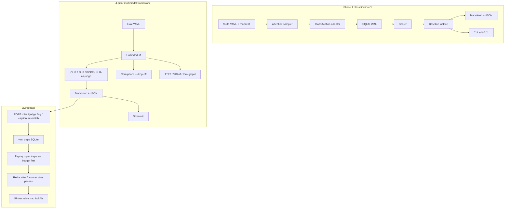

# VisionEval

**The eval harness that remembers when your VLM hallucinates.**

[](https://github.com/nishanttyagi28/VisionEval/actions/workflows/ci.yml)
[](https://www.python.org/downloads/)
[](LICENSE)

Static multimodal benchmarks go stale the week they ship. Models memorize the set. Intermittent hallucinations never make the next leaderboard cut.

VisionEval is a **CI-native** evaluation stack for vision and VLMs:

1. A **classification release gate** that fails the job on a new failure or an accuracy drop against a git-trackable baseline.
2. A **four-pillar multimodal framework** (alignment, hallucination probes, robustness, models + dashboard).
3. **Living traps**: every VLM hallucination becomes a durable SQLite test the model must beat *twice in a row* before it is retired.

The layers sit beside each other. `visioneval run` is still the classification blocker. Living traps never write classification tables.

---

## Quick start

Python 3.10+. From the repository root:

```bash
python -m venv .venv
source .venv/bin/activate          # Windows: .\.venv\Scripts\Activate.ps1
python -m pip install -e ".[dev]"
export PYTHONPATH="$(pwd)"         # Windows: $env:PYTHONPATH = (Get-Location).Path
python -m pytest
```

**Classification CI**

```bash
visioneval run demo_suite.yaml --update-baseline
visioneval run demo_suite.yaml          # exit 0 on PASS, 1 on REGRESSION
```

**Multimodal eval + living traps** (CPU, no GPU, no API keys)

```bash
visioneval multimodal examples/multimodal/config.yaml \
  --json-out reports/mm.json --markdown-out reports/mm.md

visioneval traps list --db artifacts/traps.sqlite3
visioneval traps harvest reports/multimodal.json --db artifacts/traps.sqlite3
visioneval traps run --db artifacts/traps.sqlite3 \
  --config examples/multimodal/config.yaml --budget 8
visioneval traps update-baseline --db artifacts/traps.sqlite3 \
  --lockfile artifacts/baselines/traps.json
```

**Dashboard**

```bash
python -m pip install -e ".[ui]"
streamlit run app/streamlit_app.py
```

Full file contents: [QUICKSTART.md](QUICKSTART.md). Fail-fast walkthrough: [DEMO_GUIDE.md](DEMO_GUIDE.md).

---

## Architecture



```text
visioneval/
  cli.py                 visioneval run | multimodal | traps
  core/                  suite, attention sampler, runner, cache, baseline
  classification/        adapter loading, scoring, optional Torchvision / ONNX
  metrics/               CLIPScore, BLIP-Score, POPE, LLM-as-a-judge
  robustness/            gaussian noise, motion blur, contrast, occlusion
  models/                Fake / HuggingFace / OpenAI-compatible VLM wrappers
  profiling/             TTFT, total time, GPU VRAM, throughput
  report/                multimodal Markdown + JSON
  multimodal/            YAML config + pipeline
  traps/                 living hallucination memory (vlm_traps WAL)
app/streamlit_app.py     side-by-side comparison + traps panel
examples/                classification demo + multimodal fixtures
```

---

## Four-pillar multimodal framework

All four pillars are swappable. Tests use mocks: no weight downloads, no paid APIs.

### 1. Metrics

| Metric | What it scores | Default backend |
| --- | --- | --- |
| **CLIPScore** | Image–text alignment (`w * max(cos, 0)`, `w = 2.5`) | hashed mock |
| **BLIP-Score** | Image–text matching probability in `[0, 1]` | hashed mock |
| **POPE** | Visual hallucinations: accuracy, precision, recall, F1 | yes/no probes |
| **LLM-as-a-judge** | `detail_richness`, `factual_consistency`, `spatial_accuracy` as JSON | heuristic mock |

Real CLIP/BLIP (`transformers`) and a JSON judge (`openai`) are extras. Tests always use mocks.

### 2. Robustness

Seeded corruptions: Gaussian noise, motion blur, contrast jitter, random occlusion. Identity at severity `0`. The pipeline re-runs metrics across severities and reports **drop-off** `(clean - corrupted) / |clean|` and **resilience** `1 - mean(drop-off)`.

### 3. Models and profiling

`VisionLanguageModel` / `BaseVLM`:

- `fake` — lookup-table captioner + POPE from an object map (always importable)
- `hf` — HuggingFace Qwen2-VL / LLaVA / Auto (extra `hf`)
- `api` — OpenAI-compatible vision chat (extra `api`)

Every generation records **TTFT**, **total inference time**, **GPU VRAM** (CUDA), and **throughput**.

### 4. Dashboard and reports

See [Streamlit preview](#streamlit-preview). CLI reports use the same serializers as the dashboard export.

HF / API sketch:

```yaml
models:
  - name: qwen2-vl
    kind: hf
    model_id: Qwen/Qwen2-VL-2B-Instruct
    hf_kind: qwen2_vl
  - name: gpt-4o-mini
    kind: api
    model: gpt-4o-mini
    api_key_env: OPENAI_API_KEY   # environment only; never commit secrets
```

---

## Living traps

Static suites forget. Living traps do not.

After a multimodal run, VisionEval harvests:

- POPE misses (wrong yes/no)
- LLM-judge flags or low `factual_consistency`
- Caption vs expected-object mismatches

Each one becomes a row in **`vlm_traps`** (same SQLite WAL pattern as classification memory, **different tables**). A trap stays open until the *same model* passes it **twice in a row**. Open traps consume replay budget before new samples. An optional seeded generator mints a hard-negative POPE variant (same image, rewritten probe or swapped absent object).

```bash
visioneval traps list --db artifacts/traps.sqlite3 --status open
visioneval traps harvest reports/multimodal.json --db artifacts/traps.sqlite3 \
  --generate-hard-negatives --seed 0
visioneval traps run --db artifacts/traps.sqlite3 \
  --config examples/multimodal/config.yaml --budget 8 --retire-after 2
visioneval traps update-baseline --db artifacts/traps.sqlite3 \
  --lockfile artifacts/baselines/traps.json
```

`update-baseline` writes a git-trackable JSON lock of open-trap ids and outcomes. A retired trap that reappears, or an open trap that gets worse, is a **regression** (`visioneval traps run --check-baseline` exits `1`).

Opt-in in multimodal YAML:

```yaml
traps:
  enabled: true
  db: artifacts/traps.sqlite3
  retire_after_consecutive_passes: 2
  generate_hard_negatives: true
```

The `fake-sparse` demo model (`A shape.`) typically mints caption + judge traps so you can exercise the loop without a GPU.

---

## Streamlit preview

```bash
python -m pip install -e ".[ui]"
streamlit run app/streamlit_app.py
```

From the repo root you get:

| Pane | What you see |
| --- | --- |
| **Input** | Demo fixture (`red_square` / `blue_circle`) or an uploaded image, plus present / absent objects for POPE |
| **Model columns** | Side-by-side generations (Fake always; HF / API if extras are installed) |
| **Hallucination** | POPE F1 with accuracy, precision, recall, yes-ratio |
| **Profiling** | TTFT, total ms, VRAM |
| **Radar** | CLIP, BLIP, POPE F1, detail / factual / spatial judge scores |
| **Traps still open** | Sidebar count + trap ids from `artifacts/traps.sqlite3` |
| **Export** | Download the same Markdown and JSON the CLI writes |

This dashboard is the multimodal UI. It is **not** the classification CI gate. CLI and pytest never import Streamlit.

---

## CLI

```text
visioneval run SUITE [--update-baseline]
visioneval multimodal CONFIG [--json-out PATH] [--markdown-out PATH]
visioneval traps list          [--db PATH] [--status open|retired|all]
visioneval traps harvest REPORT [--db PATH] [--generate-hard-negatives] [--seed N]
visioneval traps run           [--db PATH] [--config YAML] [--model NAME]
                               [--budget N] [--retire-after N]
                               [--check-baseline LOCK]
                               [--generate-hard-negatives] [--seed N]
visioneval traps update-baseline [--db PATH] [--lockfile PATH]
```

| Command | Role |
| --- | --- |
| `visioneval run` | Classification release gate. Exit `1` on regression. |
| `visioneval multimodal` | Four-pillar VLM eval. Does not fail the Phase 1 gate. |
| `visioneval traps *` | Harvest, replay, and lock VLM hallucinations. |

---

## Phase 1 classification CI

Aggregate accuracy can hide a drop on safety-critical or previously failing images. VisionEval evaluates a **deterministic, risk-focused subset** and treats a new failure or an accuracy drop on the **same locked population** as a release blocker.

Selection is seed-stable, highest matching bucket wins:

1. Previous failures (SQLite history)
2. Configured high-risk tags
3. Catalog confidence at or below the threshold
4. Seeded random coverage

Default budget split: **40% / 30% / 15% / 15%**. Unused quota spills forward. Records store `selection_reason`, `attention_score`, and `risk_bucket`.

Failure memory keeps `fail_count` and `consecutive_passes`. A sample stays in the previous-failure bucket until it **passes twice in a row**. The same database caches predictions (model id, preprocess id, image bytes).

`--update-baseline` writes a sorted JSON lockfile. Later runs compare only ids present in both selections, treat a disjoint selection as a regression, and fail if suite hash, model id, seed, or budget do not match. With `execution.fail_fast: true`, evaluation stops on the first **new** failure. Do not pass `--update-baseline` in CI.

---

## Install extras

```bash
pip install -e ".[dev]"           # tests + core
pip install -e ".[hf,api,ui]"     # real VLMs, OpenAI-compatible APIs, Streamlit
pip install -e ".[metrics]"       # real CLIP/BLIP (pulls torch)
pip install -e ".[all]"           # everything
```

A laptop without a GPU can `import visioneval` and run the fake/mock stack. HuggingFace and API adapters raise an `ImportError` that names the extra.

---

## How the layers compose

| Concern | `visioneval run` | `visioneval multimodal` | `visioneval traps` |
| --- | --- | --- |
| Task | Image classification | Captioning / VQA / VLM comparison | Persistent hallucination tests |
| Gate | Baseline lockfile, exit 1 | Report scores | Trap lockfile, exit 1 on `--check-baseline` |
| Memory | `sample_outcomes` / `predictions` | None by default | `vlm_traps` |
| Sampling | Attention budget | Explicit sample list | Open traps first |
| CI | pytest covers all three; mocks keep it CPU-only | same | same |

Use the classification harness as the vision release blocker. Use the multimodal layer to compare VLMs. Use living traps so yesterday's hallucination is tomorrow's regression test.

---

## Tests

```bash
python -m pip install -e ".[dev]"
python -m pytest
```

Coverage: CLIP/BLIP math, POPE, corruptions, degradation, reports, VLM fakes/stubs, profiling, multimodal pipeline, traps (harvest / retire / hard-negatives / sqlite isolation). Tests never download HuggingFace weights or call paid APIs.

---

## Roadmap

**Present:** classification CI, four-pillar multimodal eval, living traps, Streamlit.

**Next:** deterministic process-pool execution for complete, non-fail-fast Phase 1 runs. Fail-fast stays sequential.

**Out of scope for Phase 1:** detection, OCR, segmentation, distributed runners, cloud services.

Known Phase 1 gaps: [ARCHITECTURE_GAP_REPORT.md](ARCHITECTURE_GAP_REPORT.md).

## Contributing

Keep changes small, deterministic, and tested (`python -m pytest`). Prefer plain functions and dataclasses. Do not break `visioneval run` when extending multimodal or traps.

## License

Apache-2.0. See [LICENSE](LICENSE).
