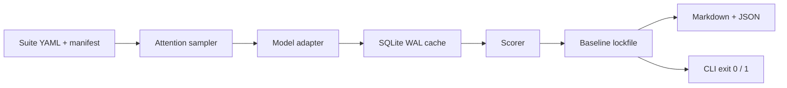

# VisionEval

**CI-first evaluation harness for image-classification models.** It spends a fixed budget on the samples most likely to regress, compares the result to a git-trackable baseline, and fails the job with evidence—not a single accuracy number.

Phase 1 supports **image classification** only. It is not a training framework, serving stack, data platform, or dashboard.

## The problem

Aggregate accuracy can hide a drop on safety-critical or previously failing images. Scoring every sample on every commit is often too slow for CI. VisionEval evaluates a **deterministic, risk-focused subset** and treats a new failure or an accuracy drop on the **same locked population** as a release blocker.

## Architecture



```text
visioneval/
  cli.py              visioneval run
  core/               suite, sampler, runner, cache, baseline, reports
  classification/     adapter loading, scoring, optional Torchvision / ONNX backends
examples/             suite YAML template
tests/                pytest
```

## Attention-guided evaluation

Selection is seed-stable and ordered by priority. A sample is chosen once, at its highest matching bucket:

1. Previous failures (SQLite history)
2. Configured high-risk tags
3. Catalog confidence at or below the threshold
4. Seeded random coverage

Default budget split: **40% / 30% / 15% / 15%**. Unused quota from an earlier attention bucket is given to the next attention bucket before random coverage. Every record stores `selection_reason`, `attention_score`, and `risk_bucket`.

## Failure memory

The local SQLite store keeps more than the last pass/fail bit: **`fail_count`** and **`consecutive_passes`**. A sample stays in the previous-failure bucket until it **passes twice in a row**, so one recovered run does not drop intermittent failures. The same database caches predictions; keys include model identity, preprocess identity, and image bytes when `image_path` is set.

## Regression detection

`--update-baseline` writes a sorted JSON lockfile: accuracy, per-sample outcomes, suite hash, model id, attention seed, budget, and selected sample ids. Later runs:

- Compare accuracy and new/fixed failures only on **ids present in both** the baseline and the current selection.
- Treat a **disjoint** selection (no shared ids) as a regression.
- Fail if suite hash, model id, seed, or budget **do not match** the lockfile.
- Exit **1** when `is_regression` is true.

With `execution.fail_fast: true`, evaluation is sequential and stops on the first **new** failure, then writes a partial report. Do not pass `--update-baseline` in CI.

## Quick start

Python 3.10+. From the repository root:

```powershell
python -m venv .venv
.\.venv\Scripts\Activate.ps1
python -m pip install -e ".[dev]"
$env:PYTHONPATH = (Get-Location).Path
```

Add a `module:callable` adapter that maps `ClassificationSample` → `ClassificationPrediction`, a YAML manifest (`id`, `label`, `confidence`, optional `tags` / `image_path`), and a suite YAML. Then:

```powershell
visioneval run demo_suite.yaml --update-baseline
visioneval run demo_suite.yaml
```

The second command exits `0` on **PASS**. Change the adapter to return a wrong label and rerun: exit `1`, status **REGRESSION**.

Full file contents: [QUICKSTART.md](QUICKSTART.md). Walkthrough with fail-fast: [DEMO_GUIDE.md](DEMO_GUIDE.md).

The installed `visioneval` script does not put the current directory on `PYTHONPATH`; set it as above so a local adapter imports. Optional Torchvision and ONNX adapters in `visioneval.classification.backends` load lazily—install those runtimes only if you use them.

## Sample Markdown report

Produced by a fail-fast candidate run after the adapter started returning `dog` instead of `cat`:

```markdown
# VisionEval: phase1-demo

- Status: **REGRESSION**
- Accuracy: `0.0000`
- Evaluated samples: `1`
- Prediction cache: `0` hits / `1` misses
- Attention buckets: `high_risk` `1`
- Execution: **FAIL-FAST**
- Remaining samples: `2`
- Failing sample: `one` (high_risk, score `0.75`)
- Accuracy drop: `1.0000`
- New failures: `1` (`one`)
- Fixed failures: `0` (none)
```

JSON (`records`, cache totals, `regression.new_failures`) is for automation. Publish both as CI artifacts and gate on the CLI exit code. This repo’s GitHub Actions workflow runs **pytest**.

## Roadmap

**Now (Phase 1):** image classification, attention sampling, SQLite memory and prediction cache, git-native baseline lockfile, overlap-based regression, sequential fail-fast, Markdown/JSON reports.

**Next:** deterministic process-pool execution for **complete, non-fail-fast** runs. Fail-fast stays sequential so stop order and partial evidence stay unambiguous.

**Out of scope:** detection, OCR, segmentation, distributed runners, dashboards, cloud services.

## Contributing

Keep changes small, deterministic, and tested (`python -m pytest`). Prefer plain functions and dataclasses. Do not add other modalities until Phase 1 needs them.

## License

Apache-2.0.
